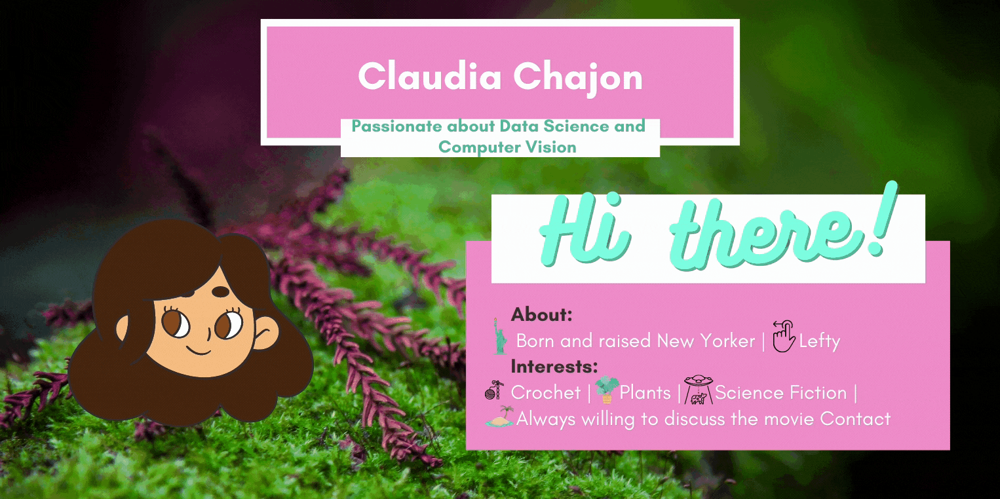

<h2> Connect <h2> 
  

  
  &nbsp;&nbsp;
  &nbsp;&nbsp;
    &nbsp;&nbsp;
  &nbsp;&nbsp;
  &nbsp;&nbsp;
  

<!--
**claudiasofiaC/claudiasofiaC** is a ✨ _special_ ✨ repository because its `README.md` (this file) appears on your GitHub profile.

-->
